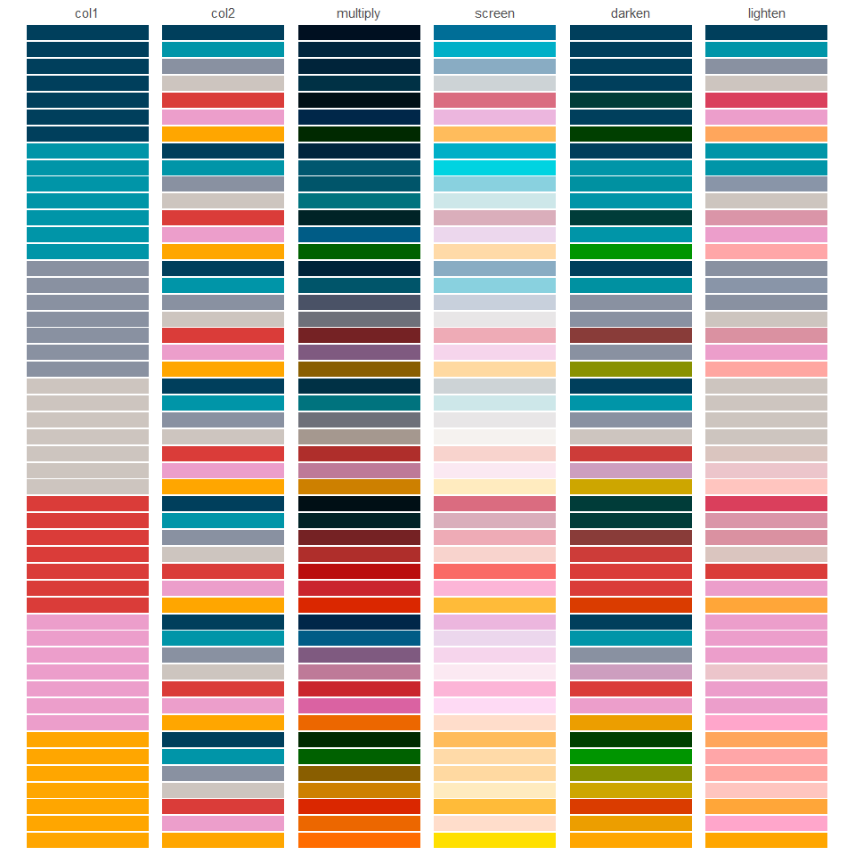
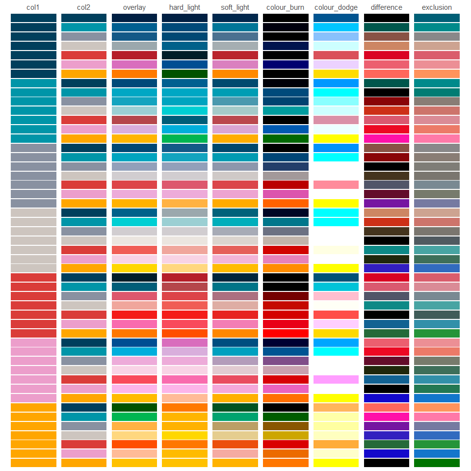

<!-- README.md is generated from README.Rmd. Please edit that file -->

# paletteblend <a href="https://davidhodge931.github.io/paletteblend/"></a>

<!-- badges: start -->

[](https://CRAN.R-project.org/package=paletteblend)
<!-- badges: end -->

The objective of paletteblend is to blend colours, palettes or palette
functions using blend modes, such as multiply and screen.

## Installation

Install from CRAN, or development version from
[GitHub](https://github.com/).

``` r
install.packages("ggwidth") 
pak::pak("davidhodge931/ggwidth")
```

``` r
library(paletteblend)
library(jumble)
scales::show_col(c(teal, orange, multiply(teal, orange)), ncol = 3)
```




