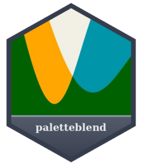
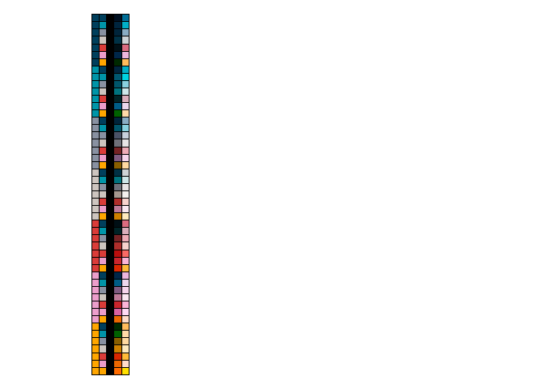

<!-- README.md is generated from README.Rmd. Please edit that file -->

# paletteblend <a href="https://davidhodge931.github.io/paletteblend/"></a>

<!-- badges: start -->

[](https://CRAN.R-project.org/package=paletteblend)
<!-- badges: end -->

The objective of paletteblend is to blend colours, palettes or palette
functions using blend modes, such as multiply and screen.

## Installation

Install from CRAN, or development version from
[GitHub](https://github.com/).

``` r
install.packages("ggwidth") 
pak::pak("davidhodge931/ggwidth")
```

``` r
library(paletteblend)
library(dplyr)
library(jumble)

blended <- multiply(teal, orange)

scales::show_col(c(teal, orange, blended), ncol = 3)
```


The below image provides the multiply output in column 4 and screen
output in column 5 of columns 1 and 2.

``` r
tidyr::crossing(col1 = jumble::jumble, col2 = jumble::jumble) |>
  rowwise() |>
  mutate(black = "black") |>
  mutate(multiply = paletteblend::multiply(col1, col2)) |>
  mutate(screen = paletteblend::screen(col1, col2)) |>
  ungroup() |> 
  tidyr::pivot_longer(everything()) |> 
  pull() |> 
  scales::show_col(ncol = 5, labels = FALSE)
```


